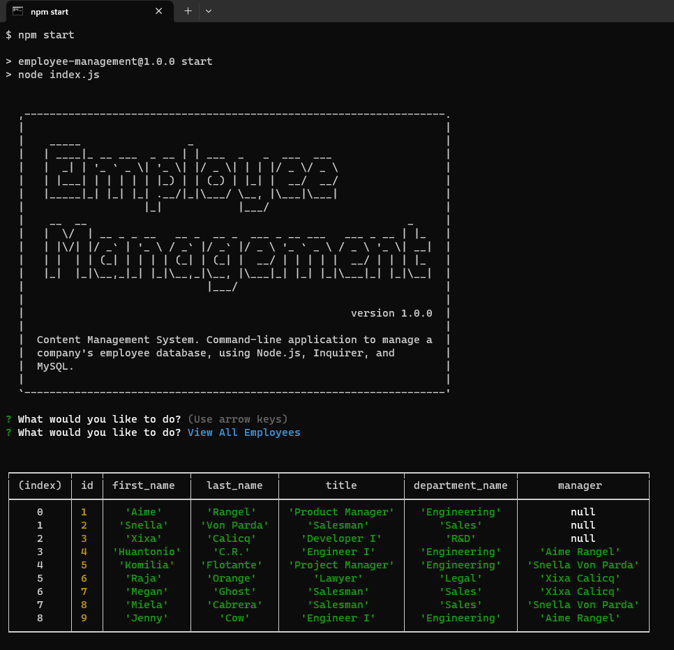

# M11C Note Taker Express.js ECR
# M12C Employee Tracker CMS (Content Management System) - ECR

## Description

This application let the user navigate through the database, sort by employees, roles or departments. 
This application also let the user add new employees, roles, and departments.
This application also let the user delete employees, roles, and departments.
Content Management System. Command-line application to manage a company's employee database, using Node.js, Inquirer, and MySQL.

## Table of Contents
- [ Walkthrough ](#walkthrough)
- [ Instalation ](#instalation)
- [ Usage ](#usage)
- [ License](#license)
- [ Contributing](#Contributing)
- [ Test ](#test)
- [ Questions ](#questions)

## Walkthrough

The following video demonstrates the functionality of the note taker: 

see video here: [Walkthrough video](https://drive.google.com/file/d/1lt25T9fVujixio3Q6ygnvi0YAsfoG18e/view?usp=drive_link)

## Instalation

To install necessary dependencies, run the following command:

> npm i 

## Usage

1. Clone the repository to your local machine.
2. In the terminal, navigate to the repository directory.
3. Run the following command to generate a README file:

>npm start

  
## License
    
This project is licensed under the following license:

## Contributing

This repository is open source and contributions are welcome. If you have any ideas for improvements, please feel free to open an issue or submit a pull request.

## Questions

If you have any questions about the repo, open an issue or contact me directly at [cruz.rosales.ernesto@gmail.com](mailto:cruz.rosales.ernesto@gmail.com). You can find more of my work at [neto1895](https://github.com/neto1895)

